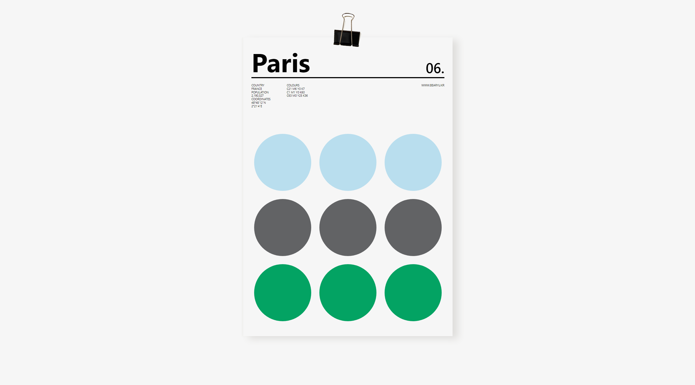
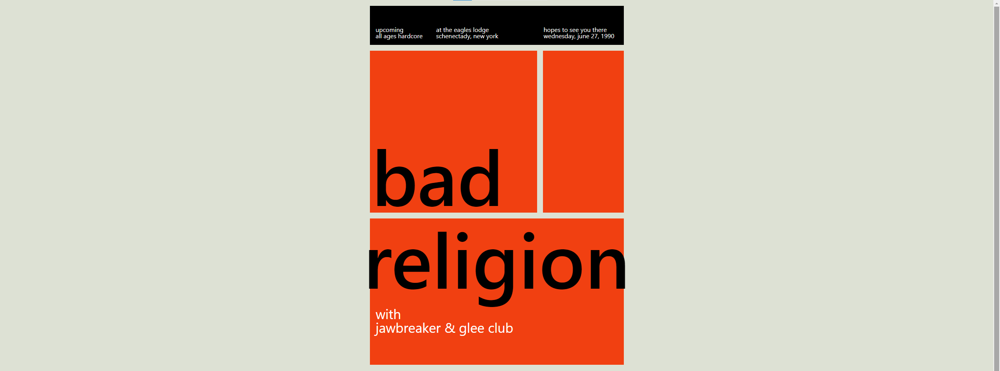
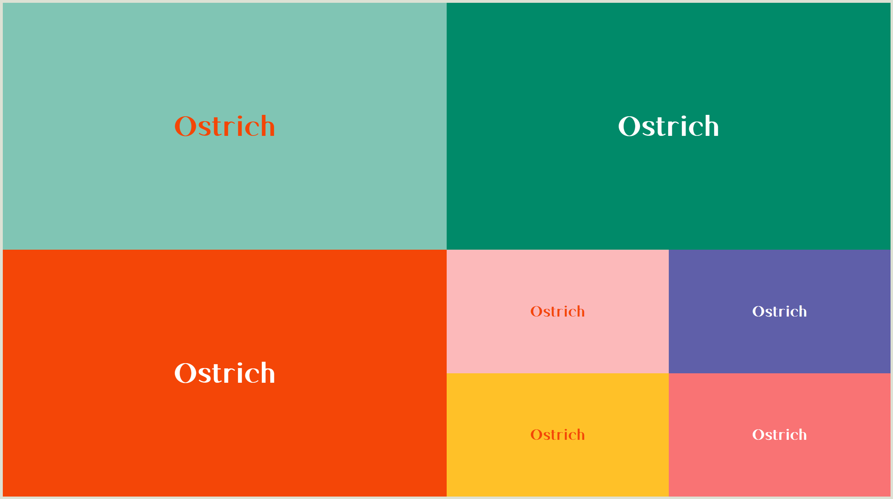
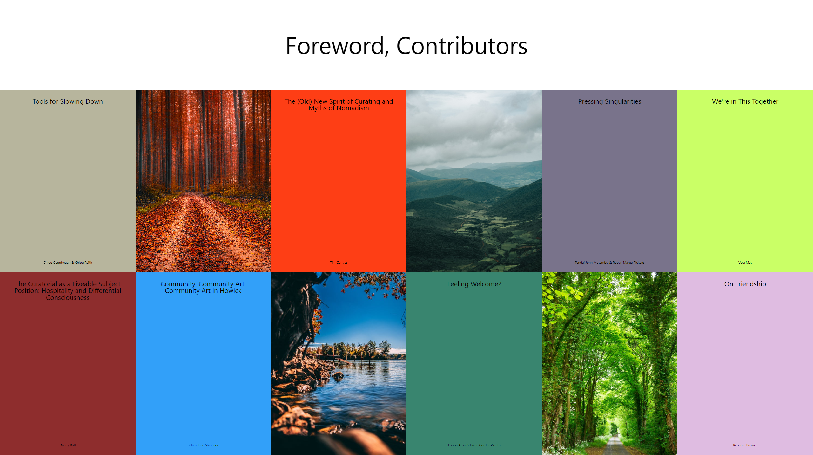
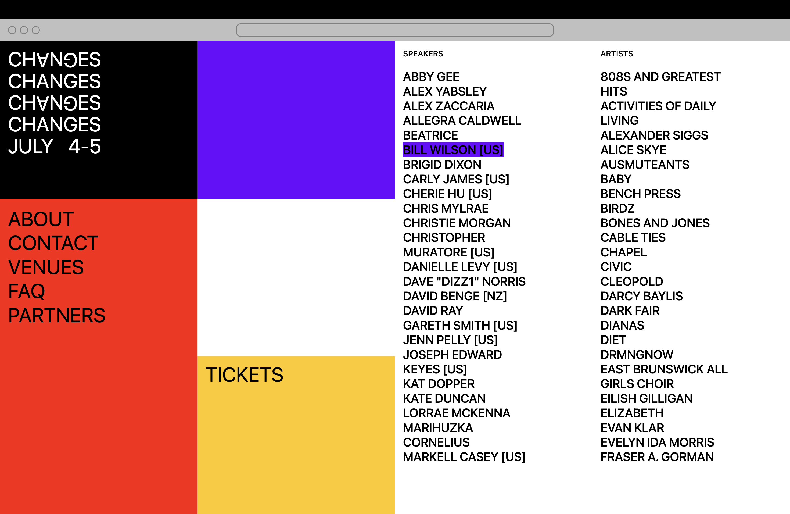
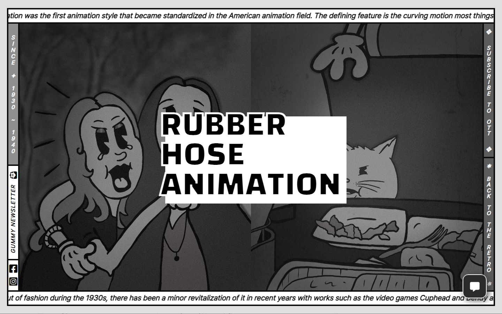
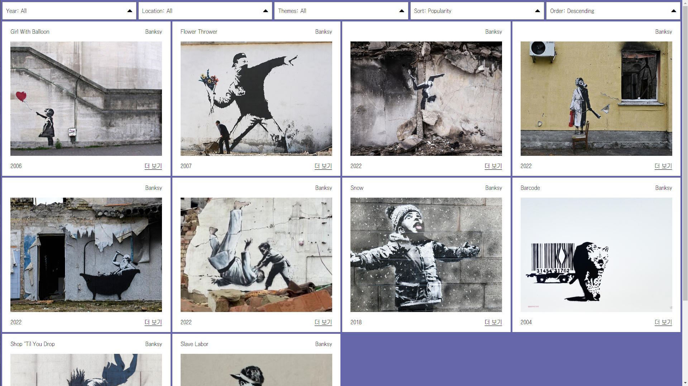
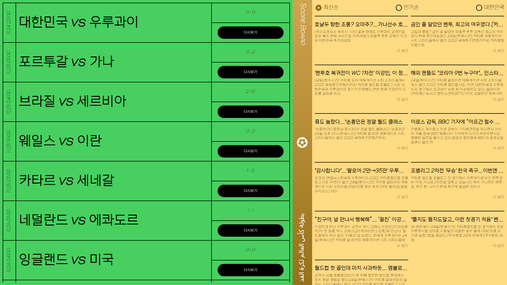

# CSS-Layout
FLEX와 GRID를 사용해 기초적인 CSS 레이아웃을 작성하여 만든 작업물입니다.

## <a href="https://bearyu99.github.io/CSS-Layout/Paris-Color" target="_blank">Paris Color</a>

## [Bad Religion](https://bearyu99.github.io/CSS-Layout/Bad-Religion){:target="_blank"}

## [Color Palette](https://bearyu99.github.io/CSS-Layout/Color-Palette){:target="_blank"}

## [Auto Fill](https://bearyu99.github.io/CSS-Layout/Auto-Fill){:target="_blank"}

## [Ticket](https://bearyu99.github.io/CSS-Layout/Ticket){:target="_blank"}

## [Rubber Hose Animation](https://bearyu99.github.io/CSS-Layout/Rubber-Hose-Animation){:target="_blank"}

## [Banksy Gallery](https://bearyu99.github.io/CSS-Layout/Banksy-Gallery){:target="_blank"}

## [Scoreboard](https://bearyu99.github.io/CSS-Layout/Scoreboard){:target="_blank"}

## [Cosmetics](https://bearyu99.github.io/CSS-Layout/Cosmetics){:target="_blank"}

