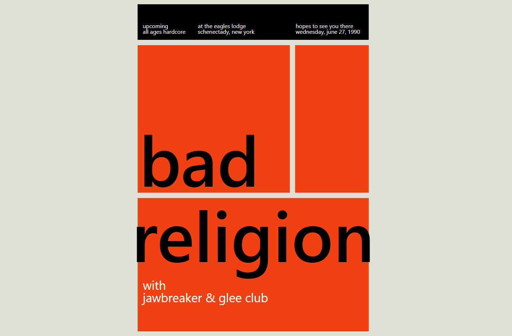

# CSS-Layout
`FLEX`와 `GRID`를 사용해 여러 사이트를 클론 코딩하였습니다.

## [Paris Color](https://bearyu99.github.io/CSS-Layout/Paris-Color)

## [Bad Religion](https://bearyu99.github.io/CSS-Layout/Bad-Religion)

## [Color Palette](https://bearyu99.github.io/CSS-Layout/Color-Palette)

## [Auto Fill](https://bearyu99.github.io/CSS-Layout/Auto-Fill)

## [Ticket](https://bearyu99.github.io/CSS-Layout/Ticket)

## [Rubber Hose Animation](https://bearyu99.github.io/CSS-Layout/Rubber-Hose-Animation)

## [Banksy Gallery](https://bearyu99.github.io/CSS-Layout/Banksy-Gallery)

## [Scoreboard](https://bearyu99.github.io/CSS-Layout/Scoreboard)

## [Cosmetics](https://bearyu99.github.io/CSS-Layout/Cosmetics)

